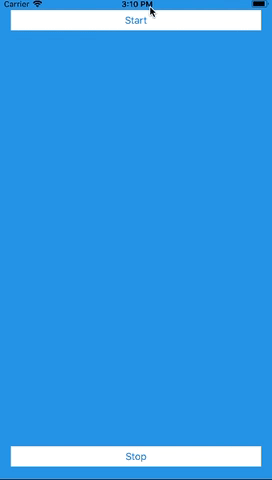

# Loadmation
> Awesome loading animation.

[](https://cocoadocs.org/docsets/NSStringMask)

A custom loading animation for Swift.



## Installation

iOS  - Swift:

Add Loadmation to your pod file.
```sh
pod 'Loadmation'
```
Install Loadmation
```sh
pod install
```

## Usage example

Import Loadmation.

```sh
import Loadmation
```

Initialize Loadmation

Create an object of Loadmation

```var loadmation : Loadmation!```

In your ```viewDidLoad()``` or any other method initialize object as: 

```sh
self.loadmation = Loadmation(parent: self.loadingView, style: Loadmation.Styles.Circular.rawValue, frame: self.loadingView.frame)
```

> TIP: You can add container view any background color in storyboard.


Start loading animation

```sh
self.loadmation.startAnimation()
```

Stop loading animation

```sh
self.loadmation.stopLoadingAnimation()
```


## Supported loading animation styles

* Circular
    * ```Loadmation.Styles.Circular.rawValue```

## Meta

Saqib Omer – [@LinkedIn](https://www.linkedin.com/in/saqibomer/) – saqibomer.cs@gmail.com

Distributed under the MIT license. See ``LICENSE`` for more information.

[https://github.com/saqibomer/loadmation](https://github.com/saqibomer/)
